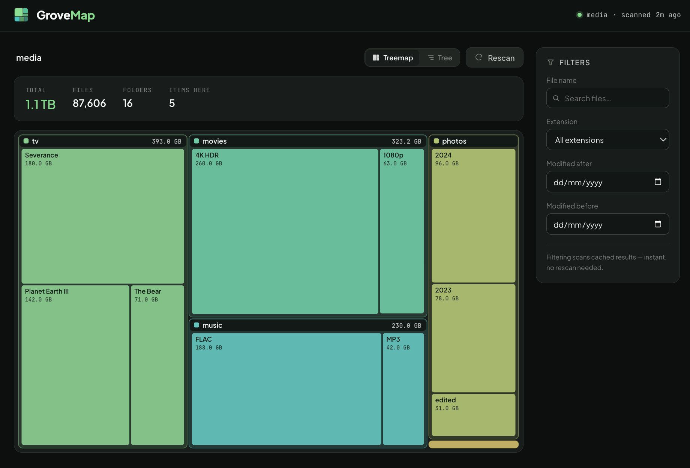
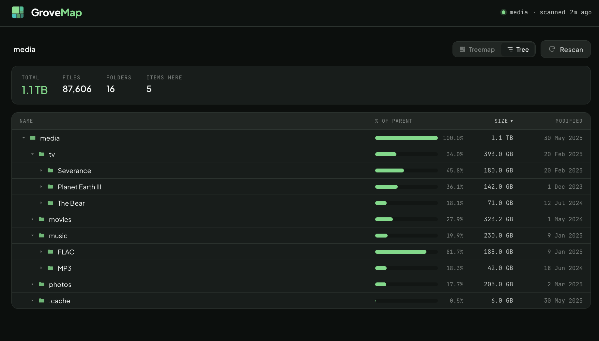

<p align="center">
  
</p>

<h1 align="center">GroveMap</h1>

<p align="center">Disk usage analyzer with an interactive treemap web UI.<br>Built for Unraid but runs anywhere Docker does.</p>

<p align="center">
  
  
</p>

Mount any directories into the container and GroveMap will scan them, cache the results, and present an interactive treemap you can drill into. Filter files by name, extension, or date to find what's eating your storage.

## Quick Start

```bash
docker build -t grovemap .
docker run -d -p 8080:8080 -v /mnt/user:/data/user:ro --name grovemap grovemap
```

Open `http://your-server:8080`.

## Features

- **Interactive treemap** - proportional visualization of disk usage, click to drill down
- **Tree list view** - sortable hierarchical breakdown with size bars and modified dates; toggle between treemap and tree from the header
- **Multiple volumes** - mount as many directories as you need under `/data/`
- **Filtering** - search by file name, extension, or modification date range
- **Background scanning** - UI stays responsive while scans run
- **Auto-discovery** - any directory under `/data/` becomes a scannable root
- **Read-only** - all mounts use `:ro`, GroveMap never modifies your files

## Configuration

| Environment Variable | Default | Description |
|---------------------|---------|-------------|
| `SCAN_CACHE_TTL` | `300` | Seconds a scan result is served before it is considered stale. Once stale, the next request keeps returning the existing tree while a fresh scan runs in the background (the UI never blanks). |
| `SCAN_ON_START` | `true` | Automatically scan all roots when the container starts |
| `DATA_ROOT` | `/data` | Base path where mounted volumes are discovered |
| `STATIC_DIR` | `/app/static` | Directory the built frontend is served from |

> **Note:** the web UI port is fixed at `8080` inside the container (the `uvicorn` command hardcodes it). To change it, remap the port at the Docker level (`-p 9000:8080`) rather than setting an env var.

Invalid or empty values for `SCAN_CACHE_TTL` / `SCAN_ON_START` fall back to their defaults rather than crashing the container.

## Unraid Installation

### Via Docker CLI

```bash
docker run -d \
  --name grovemap \
  -p 8080:8080 \
  -v /mnt/user/media:/data/media:ro \
  -v /mnt/user/documents:/data/documents:ro \
  -e SCAN_CACHE_TTL=300 \
  --restart unless-stopped \
  grovemap
```

### Via Unraid Docker UI

1. Go to **Docker > Add Container**
2. Set **Repository** to `grovemap` (or your built image name)
3. Add a **Port** mapping: host `8080` -> container `8080`
4. Add **Path** mappings for each directory to scan:
   - Host: `/mnt/user/media` -> Container: `/data/media`, Access: **Read Only**
5. Set **WebUI** to `http://[IP]:[PORT:8080]`

The Unraid Community Apps template is `templates/grovemap.xml` (this is the one kept in sync with the published image). A legacy `unraid-template.xml` also exists at the repo root.

## Development

### Prerequisites

- Python 3.12+
- Node.js 20+
- npm

### Backend

```bash
cd backend
pip install -r requirements.txt
DATA_ROOT=./test-data STATIC_DIR=../frontend/dist uvicorn main:app --reload --port 8080
```

### Frontend

```bash
cd frontend
npm install
npm run dev
```

The Vite dev server runs on port 5173 and proxies `/api` requests to the backend on port 8080.

### Project Structure

```
grovemap/
├── Dockerfile              # Multi-stage build (node + python-alpine)
├── docker-compose.yml      # Local testing with Docker
├── templates/
│   └── grovemap.xml        # Unraid Community Apps template (maintained)
├── unraid-template.xml     # Legacy Unraid template
├── backend/
│   ├── requirements.txt    # fastapi, uvicorn
│   ├── main.py             # API routes + SPA serving (path-confined)
│   ├── scanner.py          # Recursive directory scanner (os.scandir)
│   └── cache.py            # In-memory stale-while-revalidate scan cache
└── frontend/
    ├── package.json
    ├── vite.config.ts      # Dev proxy to backend
    └── src/
        ├── App.tsx         # Root selector / treemap view routing
        ├── api/client.ts   # React Query hooks
        ├── utils.ts        # formatSize, formatDate, color palette
        └── components/
            ├── RootSelector.tsx   # Volume cards with scan status
            ├── TreemapView.tsx    # Main view: shared header + view toggle
            ├── Treemap.tsx        # d3-hierarchy SVG treemap
            ├── TreeListView.tsx   # Sortable hierarchical list with size bars
            ├── ViewToggle.tsx     # Treemap / Tree segmented control
            ├── Breadcrumb.tsx     # Drill-down navigation
            ├── FilterPanel.tsx    # Name/extension/date filters
            ├── FileList.tsx       # Filtered file results table
            └── ScanStatus.tsx     # Scan progress indicator
```

### API Endpoints

| Method | Endpoint | Description |
|--------|----------|-------------|
| `GET` | `/api/roots` | List mounted volumes with scan status |
| `GET` | `/api/tree?root=...&depth=3&path=...` | Directory tree with sizes |
| `GET` | `/api/files?root=...&name=...&extension=...` | Filtered file listing |
| `POST` | `/api/scan?root=...` | Trigger a rescan |
| `GET` | `/api/status` | Scan status for all roots |

### Architecture Decisions

- **No database** - scan results are cached in memory only; all scan state is lost on restart. The cache (`cache.py`) is keyed by root path and guarded by a single lock. For datasets under 500K files, a full scan completes in seconds and the memory footprint is manageable.
- **Depth-limited tree responses** - the API returns trees truncated at depth 3 (`dirs_only=false`). Nodes at the cutoff carry `has_children` so the tree list view can lazy-fetch deeper levels on expand, avoiding massive payloads. (The treemap only renders the first two depth levels; the deeper data feeds the tree list.)
- **Stale-while-revalidate scanning** - scans run in a daemon thread. Once a cached result passes `SCAN_CACHE_TTL` it is kept and served while a background rescan runs, so navigating folders never blanks the UI or forces a wait. The tree response includes a `refreshing` flag and the frontend polls (every 2s) only while an initial scan or a background refresh is in flight. A failed background refresh retains the last good result and backs off for one TTL. (This replaced earlier behavior where an expired cache triggered a blocking rescan on the next navigation — see issue #3.)
- **Read-only mounts** - volumes are mounted as `:ro` by default. The scanner only reads file metadata (`os.scandir` + `stat`), never modifies files, and does not follow symlinks when computing sizes.

### Security Model

GroveMap has **no authentication** and binds to `0.0.0.0:8080`. Anyone who can reach the port can browse the sizes and file listings of every mounted volume. Run it only on a trusted LAN (or behind a reverse proxy that adds auth), and keep all mounts read-only (`:ro`).

The API confines file access to `DATA_ROOT`: every `root`/`path` query is resolved with `realpath` and rejected if it escapes `DATA_ROOT`, and the static-file route is likewise confined to `STATIC_DIR` so it cannot be used to read arbitrary container files via `../` traversal.

### Known Limitations

- **Large / deep trees** - the scanner is recursive and holds the full tree plus a flat file list in memory, with no depth or file-count cap. Extremely deep trees can hit Python's recursion limit and very large arrays (many millions of files) can use significant memory.
- **Symlinks** - not followed during scanning (sizes exclude symlinked content), but *are* followed during root discovery, so a symlinked directory under `DATA_ROOT` may appear as a root yet scan as empty.
- **File filtering** - `/api/files` filtering and sorting run on the request thread; a query over a very large scan can be slow. The file-name search box is not debounced, and date filters use the browser's local midnight (off by the UTC offset at day boundaries).
- **Concurrency** - a manual rescan issued while a scan is already running for the same root can briefly overlap.

## License

MIT
